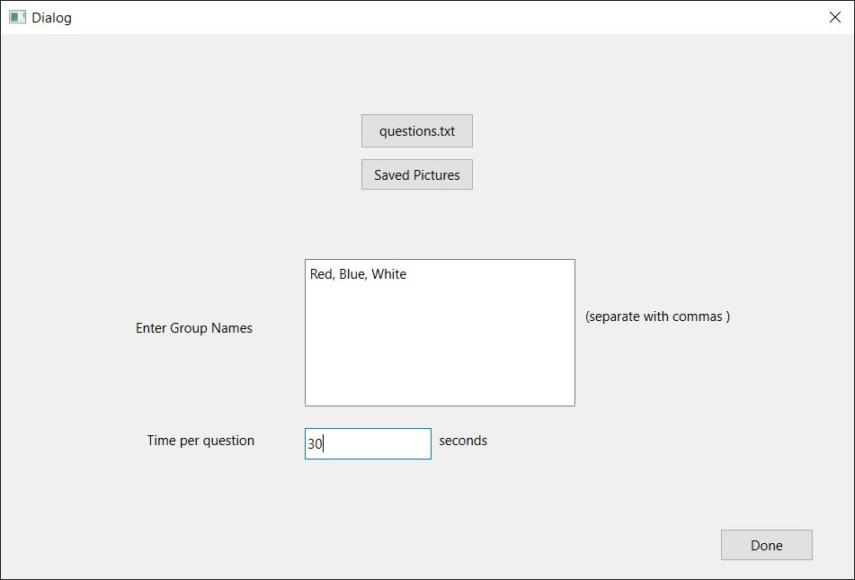
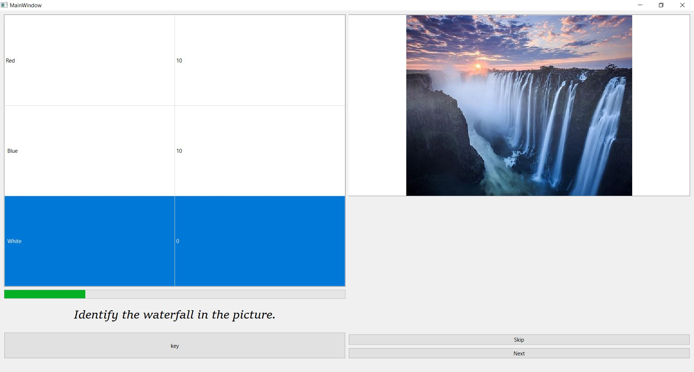
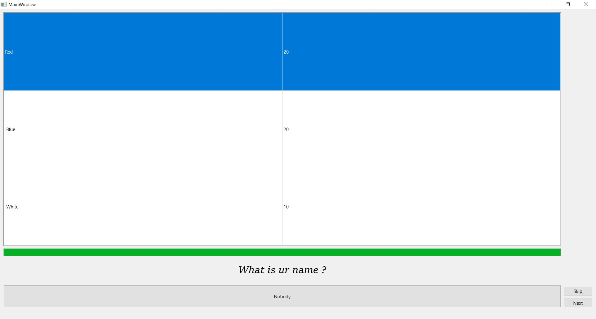

# QuizOrganizor 
for organizing quizzes in local style in Nepal

To run the executable file:
```
(https://github.com/bbread123/QuizCreator/tree/main/executable)
```
copy the executable folder link from above and paste it to [DownGit Site] below (https://minhaskamal.github.io/DownGit/#/home) 

Source files at src folder

App screenshots:
<p align="center">
  
  
  
  
</p>

