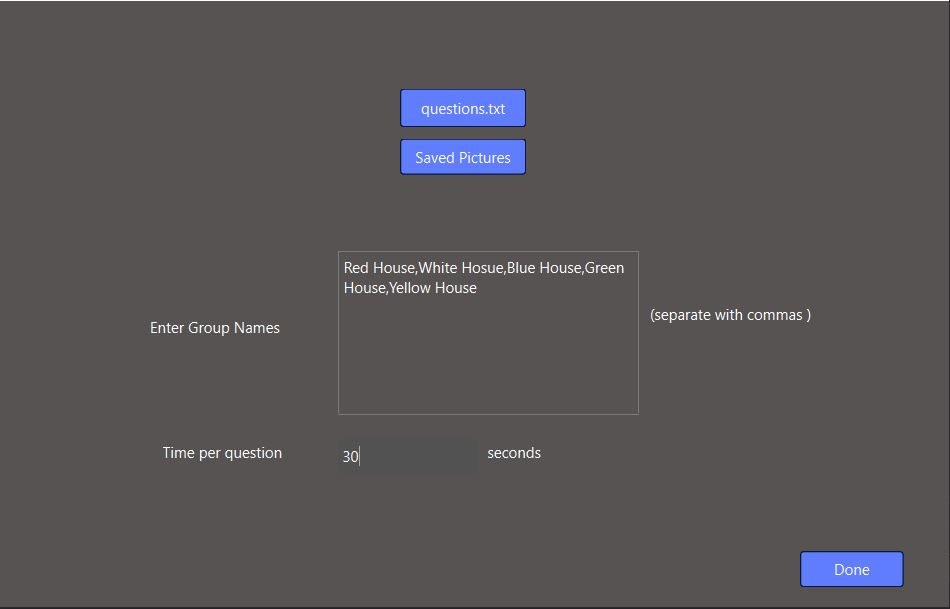
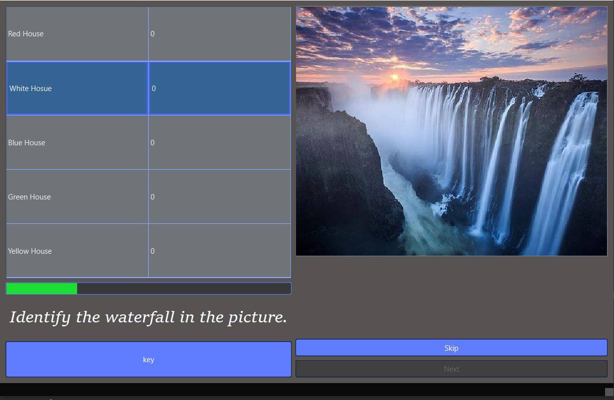
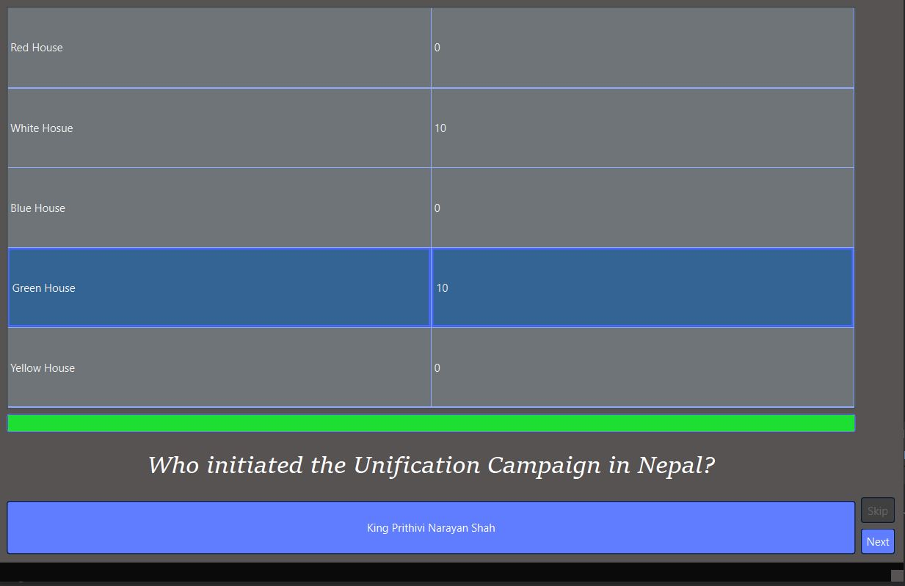
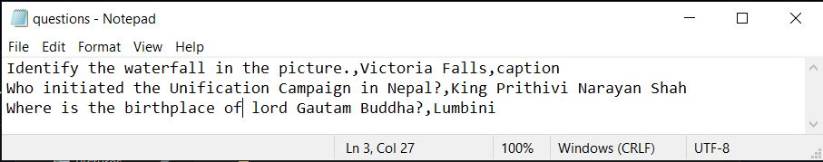

# QuizOrganizor 
for organizing quizzes in traditional style in Nepal

To run the executable file:
```
(https://github.com/bbread123/QuizCreator/tree/main/executable)
```
copy the Executable folder link from above and paste it to [DownGit Site] (https://minhaskamal.github.io/DownGit/#/home) and simply double click the "test.exe" file.

Source files at sourceFiles folder

App screenshots:
<p align="center">
  
  
  
  <br> The question file should contain a question and answer and media file name in selected media folder (optional) in a single line seperated by commas. Example <br> 
</p>


